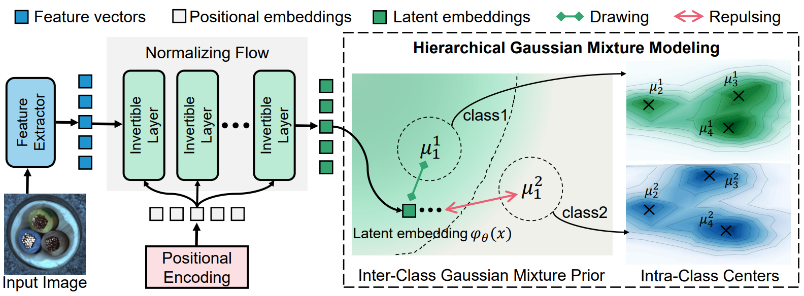

## [Hierarchical Gaussian Mixture Normalizing Flows Modeling for Unified Anomaly Detection](https://arxiv.org/abs/2403.13349)

PyTorch implementation for ECCV2024 paper, Hierarchical Gaussian Mixture Normalizing Flows Modeling for Unified Anomaly Detection.



---

## Installation
Install all packages with this command:
```
$ python3 -m pip install -U -r requirements.txt
```

## Download Datasets
Please download MVTecAD dataset from [MVTecAD dataset](https://www.mvtec.com/de/unternehmen/forschung/datasets/mvtec-ad/), BTAD dataset from [BTAD dataset](http://avires.dimi.uniud.it/papers/btad/btad.zip), MVTecAD-3D dataset from [MVTecAD-3D dataset](https://www.mvtec.com/company/research/datasets/mvtec-3d-ad), and VisA dataset [VisA dataset](https://amazon-visual-anomaly.s3.us-west-2.amazonaws.com/VisA_20220922.tar).


## Training
- Run code for training MVTecAD
```
python main.py --dataset mvtec --seed 0 --gpu 0
```

Normally, you can obtain the following results:
| Category | Image/Pixel AUC | Category | Image/Pixel AUC | Category | Image/Pixel AUC |
|:------------:|:--------:|:----------:|:-----:|:-----:|:-------:|
| Carpet | 1.000/0.994 | Bottle | 1.000/0.986 | Pill | 0.966/0.988 |
| Grid | 0.997/0.991 | Cable | 0.970/0.959 | Screw | 0.961/0.993 |
| Leather | 1.000/0.996 | Capsule | 0.988/0.992 | Toothbrush | 0.911/0.990 |
| Tile | 1.000/0.961 | Hazelnut | 0.998/0.988 | Transistor | 0.977/0.913 |
| Wood | 0.996/0.959 | Metal nut | 1.000/0.981 | Zipper | 0.999/0.990 |
| Mean | 0.984/0.979 | 

- Run code for training BTAD
```
python main.py --dataset btad --seed 0 --gpu 0
```

Normally, you can obtain the following results:
| Category | Image/Pixel AUC | Category | Image/Pixel AUC | Category | Image/Pixel AUC |
|:------------:|:--------:|:----------:|:-----:|:-----:|:-------:|
| 01 | 1.000/0.976 | 02 | 0.859/0.973 | 03 | 0.987/0.990 |
| Mean | 0.949/0.980 | 

- Run code for training MVTecAD-3D
```
python main.py --dataset mvtec3d --seed 0 --gpu 0
```

Normally, you can obtain the following results:
| Category | Image/Pixel AUC | Category | Image/Pixel AUC | Category | Image/Pixel AUC |
|:------------:|:--------:|:----------:|:-----:|:-----:|:-------:|
| Bagel | 0.977/0.988 | Cable gland | 0.963/0.995 | Carrot | 0.889/0.988 |
| Cookie | 0.734/0.966 | Dowel | 0.960/0.992 | Foam | 0.811/0.917 |
| Peach | 0.829/0.994 | Potato | 0.690/0.950 | Rope | 0.976/0.992 |
| Tire | 0.876/0.986 | Mean | 0.871/0.977 | 

- Run code for training VisA
```
python main.py --dataset visa --seed 0 --gpu 0
```

Normally, you can obtain the following results:
| Category | Image/Pixel AUC | Category | Image/Pixel AUC | Category | Image/Pixel AUC |
|:------------:|:--------:|:----------:|:-----:|:-----:|:-------:|
| Candle | 0.988/0.995 | Capsules | 0.956/0.990 | Cashew | 0.910/0.991 |
| Chewinggum | 0.999/0.996 | Fryum | 0.984/0.949 | Macaroni1 | 0.991/0.998 |
| Macaroni2 | 0.926/0.997 | Pcb1 | 0.976/0.995 | Pcb2 | 0.956/0.983 |
| Pcb3 | 0.986/0.994 | Pcb4 | 0.979/0.987 | Pipe fyrum | 0.996/0.993 |
| Mean | 0.971/0.989 | 

- Run code for training Union dataset (combined by MVTecAD, BTAD, MVTecAD-3D, and VisA)
```
python main.py --dataset union --seed 0 --gpu 0
```

We also report the detailed results on the Union dataset as follows:
| Category | Image/Pixel AUC | Category | Image/Pixel AUC | Category | Image/Pixel AUC |
|:------------:|:--------:|:----------:|:-----:|:-----:|:-------:|
| Bottle | 1.000/0.982 | Cable | 0.951/0.860 | Capsule | 0.934/0.990 |
| Carpet | 1.000/0.993 | Grid | 0.986/0.983 | Hazelnut | 1.000/0.985 |
| Leather | 1.000/0.995 | Metal nut | 0.997/0.981 | Pill | 0.969/0.984 |
| Screw | 0.812/0.986 | Tile | 0.999/0.936 | Toothbrush | 0.961/0.992 |
| Transistor | 0.996/0.901 | Wood | 0.994/0.957 | Zipper | 0.999/0.992 |
| 01 | 0.997/0.974 | 02 | 0.838/0.969 | 03 | 0.995/0.997 |
| Bagel | 0.983/0.991 | Cable gland | 0.886/0.990 | Carrot | 0.815/0.990 |
| Cookie | 0.792/0.972 | Dowel | 0.896/0.978 | Foam | 0.798/0.913 |
| Peach | 0.856/0.993 | Potato | 0.625/0.958 | Rope | 0.929/0.994 |
| Tire | 0.835/0.965 |
| Candle | 0.989/0.996 | Capsules | 0.939/0.975 | Cashew | 0.928/0.987 |
| Chewinggum | 0.996/0.996 | Fryum | 0.976/0.938 | Macaroni1 | 0.975/0.997 |
| Macaroni2 | 0.903/0.995 | Pcb1 | 0.964/0.992 | Pcb2 | 0.966/0.972 |
| Pcb3 | 0.964/0.990 | Pcb4 | 0.981/0.981 | Pipe fyrum | 0.991/0.992 |
| Mean | 0.935/0.975 | 

**Note:** You need to set the root directory of your dataset in the `main.py` by setting `args.data_path`. For Union dataset, the dataset path can be set in the `datasets/union.py` script.


## Citation

If you find this repository useful, please consider citing our work:
```
@article{HGAD,
      title={Hierarchical Gaussian Mixture Normalizing Flows Modeling for Unified Anomaly Detection}, 
      author={Xincheng Yao and Ruoqi Li and Zefeng Qian and Lu Wang and Chongyang Zhang},
      year={2024},
      booktitle={European Conference on Computer Vision 2024},
      url={https://arxiv.org/abs/2403.13349},
      primaryClass={cs.CV}
}
```

If you are interested in our work, you can also follow our other works: [BGAD (CVPR2023)](https://github.com/xcyao00/BGAD), [PMAD (AAAI2023)](https://github.com/xcyao00/PMAD), [FOD (ICCV2023)](https://github.com/xcyao00/FOD), [ResAD (NeurIPS2024)](https://github.com/xcyao00/ResAD). Or, you can follow our github page [xcyao00](https://github.com/xcyao00).
